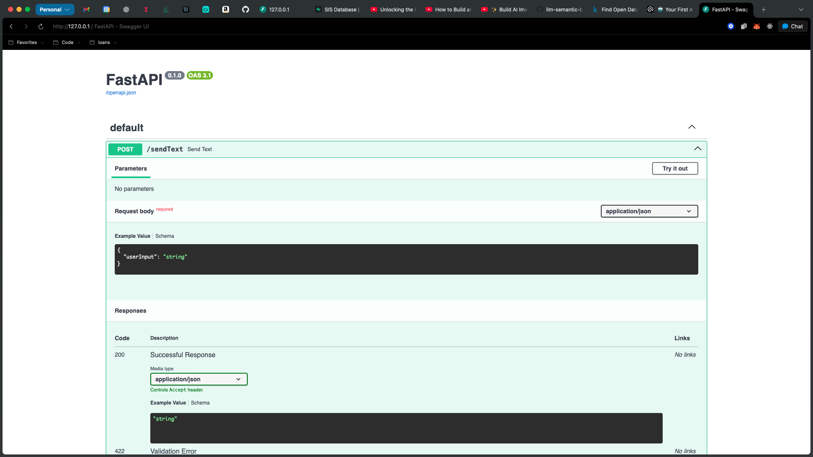
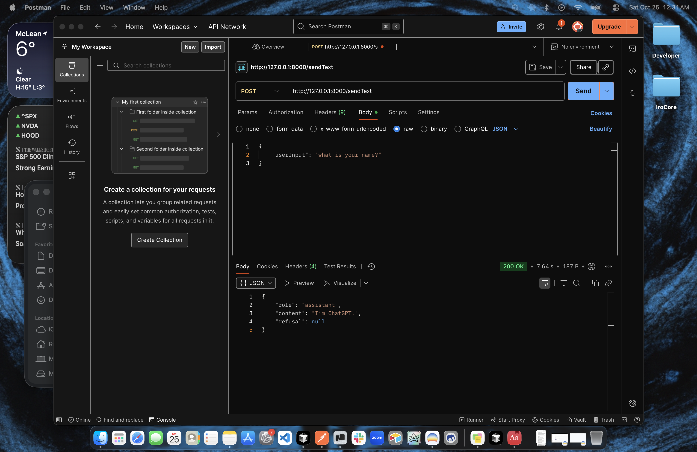

# Building a Chat App Backend Using FastAPI and OpenAI

This project is a backend for a chat application that sends user messages to the OpenAI API and gets AI-powered responses, all wrapped up neatly with FastAPI. Our own "GPT wrapper"!

1. **Set Up a Virtual Environment**

To keep dependencies organized, start by setting up a virtual environment. You can do this with:

```bash
python -m venv fastapi-openai
source fastapi-openai/bin/activate
pip install -r requirements.txt
```

2. **Organize Routes**

Created a `routes` folder for better code organization. Inside, an `__init__.py` file marks the folder as a Python package, allowing easy imports elsewhere in the project.

3. **Create the API Route**

Added a POST route for sending chat messages.

---

## Learnings and Key Design Choices

- **Python Logging**  
  Utilized the `logging` module for the first time to track API activity and facilitate debugging. Adding statements like `logger.debug()` helped monitor both incoming data and error messages, making troubleshooting much easier.

- **Modular Chat Helper**  
  The chat logic is encapsulated in `openai_helper.py`, which contains a `chat_helper` function to interface with the OpenAI API. Here’s how it works:

```python
import logging
from typing import List, Dict
from fastapi import HTTPException
from config import client

logger = logging.getLogger(__name__)

async def chat_helper(message: Dict, model: str = 'gpt-5',
                      system_configuration: str = 'You are a helpful assistant',
                      message_history: List[Dict] = []):
    messages = [{'role': 'system', 'content': system_configuration}] + message_history + [message]
    logger.debug(f'chat_helper - Sending messages: {messages}')
    try:
        completion = client.chat.completions.create(
            model=model,
            messages=messages
        )

        logger.debug(f'chat_helper - Received completion: {completion}')
        response_message = {
            'role': 'assistant',
            'content': completion.choices[0].message.content,
            'refusal': None
        }
        return response_message
    except Exception as e:
        logger.error(f'chat_helper - Error: {e}')
        raise HTTPException(status_code=500, detail=str(e))
```
  The function builds the chat context, sends it to OpenAI, and neatly handles the response or any errors. It’s asynchronous and flexible, accepting conversation history and custom configurations.

- **Configuration File for Secrets**

  A dedicated `config.py` file manages the OpenAI API key securely:

```python
import openai
import os
from dotenv import load_dotenv

# Load environment variables
load_dotenv()

# Initialize OpenAI client
client = openai.OpenAI(api_key=os.getenv("OPENAI_API_KEY"))
```

  This setup ensures your API key remains private, loading credentials from a `.env` file and keeping secrets out of your codebase.

- **Project Entry Point**

  The `main.py` file initializes the FastAPI app, adds CORS middleware for cross-domain requests, and includes the routes:

```python
from fastapi import FastAPI
from fastapi.middleware.cors import CORSMiddleware
from routes.send_messages import router as send_messages_router

app = FastAPI()

app.add_middleware(
    CORSMiddleware,
    allow_origins=["*"],
    allow_credentials=True,
    allow_methods=["*"],
    allow_headers=["*"],
)

app.include_router(send_messages_router)
```

  This lets you accept API requests from the browser (or anywhere else) without CORS issues.

- **Launching and Testing**

  Start the API locally (with live reload during development) using:

```bash
uvicorn routes.main:app --reload
```

  You’ll see the interactive API docs here:

  

  And you can test message sending via tools like Postman:

  
